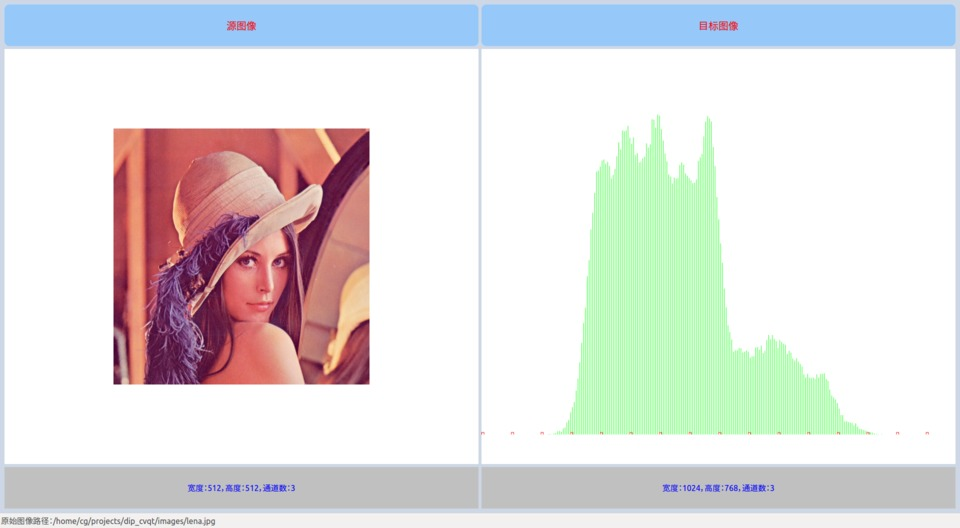

# DIP Demo with OpenCV & Qt

Digital Image Processing Demonstrations with OpenCV and Qt

----------

## Requirements

* Qt5
* OpenCV2 (minimum)

## Outline

* Salt and pepper noise
* Color reduce
* Image sharpening
* Color model transformation
* Histogram
* Binary image
* Look up table
* Histogram equalization
* Back Project
* MeanShift
* CamShift
* Gaussian Blur(Gaussian Distribution,Gaussian Function)
* Median filtering
* Mean filtering
* Skin Detection: [Skin Color Thresholding with OpenCV](http://www.bytefish.de/blog/opencv/skin_color_thresholding/)

## Related

* [Source Code](https://github.com/vinjn/opencv-2-cookbook-src) of the Book 《OpenCV 2 计算机视觉编程手册》
* [cggos/dip_vc6_matlab](https://github.com/cggos/dip_vc6_matlab): Source Code of the Book 《数字图像处理与机器视觉——Visual C++与Matlab实现》
